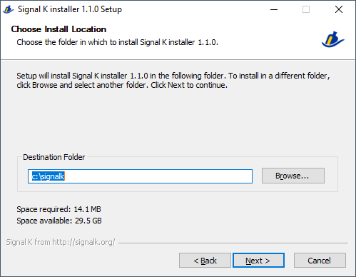
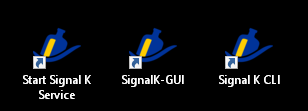

**All in one Windows installer  for Signal K server node http://signalk.org/**  
This content is work in progress...
___  
**Prerequisite:**  
- Internet connection during setup process  
  
**What's provide with this installer:**  
- The latest version of the Signal K server downloaded during installation.  
- node js 10.19.0 ( downloaded from http://nodejs.org/dist/v10.19.0/ during installation).  
- openssl 1.1.1d ( from https://slproweb.com/products/Win32OpenSSL.html ).  
- support of X64 and X86 Windows version (X86 version not tested yet).  
- All packages are installed under a root directory. You choose your root directory at the time of installation.  
- Signal K can start as windows service if you choose it at the time of installation.  
- You can re-run the installer several times.  
  
**How to install Signal K server node:**  
- Download installer at https://github.com/cmotelet/signalk-server-windows/blob/master/output/signalk-server-setup.exe  
- Execute `signalk-server-setup.exe`.  
Some anti-virus software considers that there are viruses in the installer. These are false positives.  
You may need to add the installer in your exceptions, it is sometimes quarantined.  
  
  
- Select your root directory.  
Even if this is not the Windows specification, it is better not to choose `c:\program files` to avoid limited permissions in this folder.  
Instead, choose `c:\signalk` or `d:\signalk`.  
  
  
- Select the components to be installed.  
If you select `Signal K as services` a Windows service will be created with Administrator rights and you will not need to keep a window open to run the server.  
  
  
- Then click `Install` button  
  
  
- Several windows will open successively during the installation.  
If you chose `Singal K as services` 3 message box will open asking for permission to install the Windows service.  
Answer with `OK`.  
  
  
  
- At the end, check log if no errors and close the installer with `Close` button.  
..
  
Your Signal K server is now installed.  
If you have select `Desktop shortcuts`, you will find 2 icons on your desktop:  
  
  
- `Start Signal K Service` icon will start the Signal K service if you choosed it at install, you must `Run as administrator` this icon.  
- `Signal K CLI` will open a command line windows with environment prepared for running Signal K.  
  
When Signal K server started by service or by CLI, open you web browser at URL: http://localhost:3000  
  
Then check out the website:  http://signalk.org/ or https://github.com/SignalK/signalk-server-node for more informations.  
Or ask for support at http://slack-invite.signalk.org/
  
**Software structure:**  
+ `c:\signalk` This is the root directory that you choosed at install. All components are under this root directory.  
    - `nodejs` binary and modules for node js  
    - `openssl` binary for openssl  
    - `tools` Somme tools scripts to start, stop to manage your server (see below).  
    - `signalkhome` home directory of Signal K server.  
        - `.signalk` The configuration of your server is stored in this folder
  
**The tools to manage server (located in `tools` directory):**  
- `SignalK-CLI.lnk` will open a command line windows with environment prepared for running Signal K.  
- `start-signalk-server-services.cmd` will start the Signal K service if you choosed it at install, you must `Run as administrator` this script.  
- `stop-signalk-server-services.cmd` will stop the Signal K service if you choosed it at install, you must `Run as administrator` this script.  
- `remove-signalk-server-services.cmd` will remove the Signal K windows service, use this before delete the root directory. You must `Run as administrator` this script.  
- `create-signalk-server-services.cmd` will create the Signal K windows service if you didn't choose it at installation. Cannot be re-run if `tools\daemon` directory exist. You must `Run as administrator` this script.  
  
**Delete all of your Signal K server:**  
- If you installed as service, `Run as administrator` `remove-signalk-server-services.cmd` script  
- Delete the root directory e.g. `c:\signalk`  
- That's all !  
