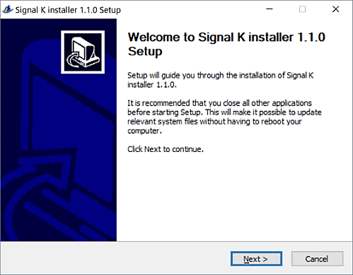
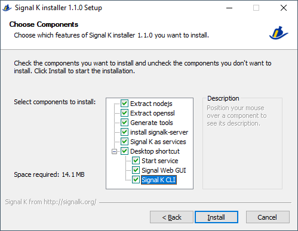
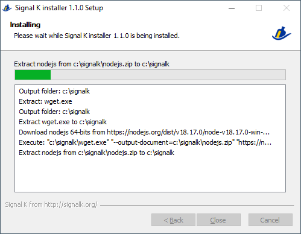
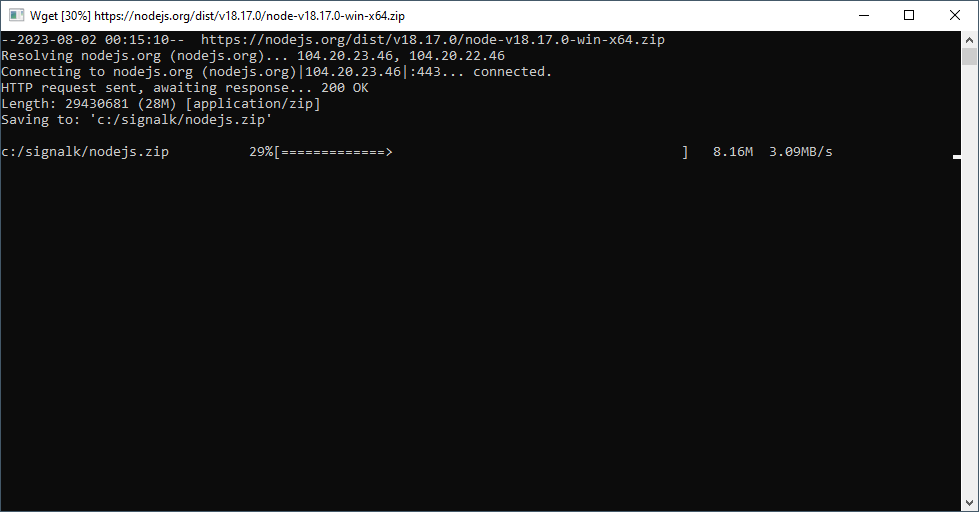
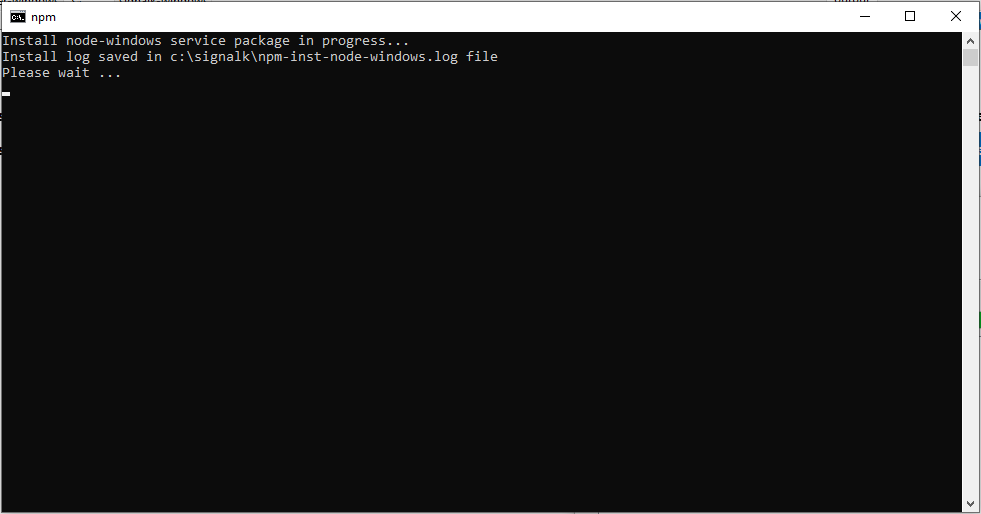

**All in one Windows installer v1.0.0 for Signal K server node http://signalk.org/**  
  
___  
**Prerequisite:**  
- Internet connection during setup process  
- **If you have already installed Signal K** with a previous installer version < 1.0.0 (included NodeJS in version 10),  
see [Upgrade from NodeJS10 / Installer 0.4.3](#Upgrade) before !  
- **If your current OS version is lower than Windows 10**,  
NodeJS 12 will be installed instead of NodeJS 16 with limited Signal K server support ( Windows 7 is end of life ).
  
**What's provide with this installer:**  
- The latest version of the Signal K server downloaded during installation.  
- NodeJS 16.13.2 ( downloaded from https://nodejs.org/dist/v16.13.2/ during installation).  
**If your current OS version is lower than Windows 10**, NodeJS 12 only will be install (https://nodejs.org/download/release/v12.22.9/)  
- openssl 1.1.1h ( from https://slproweb.com/products/Win32OpenSSL.html ).  
- support of X64 and X86 Windows version (Windows 10 X64 and Windows 7 X86 tested).  
- All packages are installed under a root directory. You choose your root directory at the time of installation.  
- Signal K can start as windows service if you choose it at the time of installation.  
- You can re-run the installer several times.  
- HTML installation help built with https://github.com/nea/MarkdownViewerPlusPlus
  
**How to install Signal K server node:**  
- Download installer at https://github.com/SignalK/signalk-server-windows/releases/latest/download/signalk-server-setup.exe  
- You can verify the checksum of the exec file at https://github.com/SignalK/signalk-server-windows/releases/latest/download/SHA256SUMS.txt  
`Get-FileHash .\signalk-server-setup.exe -Algorithm SHA256 | Format-List`  
- Execute `signalk-server-setup.exe`.  
Some anti-virus software considers that there are viruses in the installer. These are false positives.  
You may need to add the installer in your exceptions, it is sometimes quarantined.  
Please submit this file to your anti-virus support for scanning and whitelisting.  
  
  
- Select your root directory.  
Even if this is not the Windows specification, it is better not to choose `c:\program files` to avoid limited permissions in this folder.  
Instead, choose `c:\signalk` or `d:\signalk`.  
  
  
- Select the components to be installed.  
The `Signal K as services` option is selected by default, this is the most interesting option for all users. If you deselect this option, you will have to keep a Windows command line open to run the server.  
  
  
- Then click `Install` button  
  
  
- Several windows will open successively during the installation.  
  
  
  
  
- The `Signal K as services` will bring up 3 message boxes asking permission to install the Windows service.  
Answer with `OK`.  
  
- At the end, check log if no errors and close the installer with `Close` button.  
  
The install log are saved to file `install.log` in the root of your install directory.  
  
Your Signal K server is now installed.  
If you have select `Desktop shortcuts`, you will find at least 1 icons on your desktop:  
  
  
- `Start Signal K Service` icon will start the Signal K service, you must `Run as administrator` this icon.  
If you don't want to have to select every time `Run as Administrator`, in properties of the shortcut, you have a options button `Advanced...`, click and then select `Run as administrator`.  
After that, You will just have to answer `Yes` on the UAC (User Access Control) question when you clic on this icon.  
- `SignalK-GUI` icon open the web GUI of Signal K server in your web browser.  
- `Signal K CLI` icon will open a command line windows with environment prepared for running Signal K.  
This shortcut is most for advanced users.  
  
The `Signal K server` Windows service is in `manual` mode after installation, to prevent the Signal K server from starting every time you start your computer.  
To start the Signal K server Windows service, use the shortcut on the desktop `Start Signal K Service` or by the script `start-signalk-server-services.cmd` in tools directory.  
Caution, these commands must be `Run as administrator`.  
  
When the Signal K server has started by service or CLI, wait 20 to 30 seconds for the server to finish booting.  
Then open you web browser at URL: http://localhost:3000 or use the desktop shortcut `SignalK GUI`.  
  
The very first thing to do after installing and starting the server, is to create an admin user in the web GUI.  
Go to `Security` => `User` => `Create an admin account`
After that, restart the server by click on desktop icon `Start Signal K Service`.  
This command will stop the Windows service and restart it with user security enabled.  
Then reopen you web browser at URL: http://localhost:3000 and enter your admin account.  
  
Then check out the website:  http://signalk.org/ or https://github.com/SignalK/signalk-server-node for more informations.  
Or ask for support at http://slack-invite.signalk.org/ in channel #support-windows
  
**Software structure:**  
+ `c:\signalk` This is the root directory that you choosed at install. All components are under this root directory.  
    - `readme.html` minimal help file of installer.  
    - `screenshots` screenshot for the html help file.  
    - `nodejs` binary and modules for node js.  
    - `openssl` binary for openssl.  
    - `tools` Somme tools scripts to start, stop to manage your server (see below).  
    - `signalkhome` home directory of Signal K server.  
        - `.signalk` The configuration of your server is stored in this folder.  
  
**The tools to manage server (located in `tools` directory):**  
- `SignalK-CLI.lnk` open a command line windows with environment prepared for running Signal K. You do not use it if the signalk service is running.  
- `SignalK-GUI.URL` open the web GUI of Signal K server in your web browser.  
- `start-signalk-server-services.cmd` start or restart the Signal K service, you must `Run as administrator` this script.  
- `stop-signalk-server-services.cmd` stop the Signal K service, you must `Run as administrator` this script.  
- `remove-signalk-server-services.cmd` remove the Signal K windows service, use this before delete the root directory. You must `Run as administrator` this script.  
- `create-signalk-server-services.cmd` create the Signal K windows service if you didn't choose it at installation. Cannot be re-run if `tools\daemon` directory exist. You must `Run as administrator` this script.  
  
{#Upgrade}**Upgrade from NodeJS10 / Installer 0.4.3 and below**  
  
Since the installer in version 1.0.0, NodeJS is provided in version 16.  
If you have already installed Signal K with a previous version (with NodeJS version 10),  
it is recommended to make a new installation and then restore the configuration of your Signal K server later.  
- Stop your Signal K server `stop-signalk-server-services.cmd`.  
- Remove the Signal K service `remove-signalk-server-services.cmd`.  
- Close all windows related to signal K.  
- Rename your Signal K root directory: e.g. `c:\signalk` to `c:\signalk10`.  
This way, you will keep your Signal K server configuration in a safe place.  
You can also `Backup` your Signal K server configuration in GUI server: `Server` then `Backup/Restore`.  
See also the tips here, about plugin compatibility: [Updating to Node.js-16](https://github.com/SignalK/signalk-server/wiki/Updating-to-Node.js-16)
- Start installer and install Signal K in the original directory: e.g. `c:\signalk`.  
- Start the Signal K server and check first without any plugins.  
- If everything is OK, reinstall your plugins, restore your previous configuration with the `Backup/Restore` function  
or by copying the saved settings files located in `.signalk` directory from your renamed directory.  
  
**Delete all of your Signal K server:**  
- This installation is completely free of windows registry keys.  
- First of all, if you installed as service, `Run as administrator` the `remove-signalk-server-services.cmd` script in tools dirrectory.  
- You can then safely delete the root directory e.g. `c:\signalk`  
- And that's all !  
  
**Rebuild install kit:**  
- Clone Github project: `git clone https://github.com/SignalK/signalk-server-windows.git`  
- Install `nsis-3.06.1-setup.exe` located in src folder.  
- Extract `nsis-3.06.1-log.zip` located in src folder.  
- Copy the content of extracted files in the folder of NSIS install directory.  
- Extract `NSISunzU.zip` located in src folder.  
- Copy the `NSISunzU\Plugin unicode\nsisunz.dll` file of extracted files in the folder of NSIS install directory `Plugins\x86-unicode\nsisunz.dll`.  
- Run NSIS.  
- Open `NSIS\signalk-server.nsi` file in NSIS.  
- Select `Script` `Recompile`
- The new compiled install kit is located in `output` directory.  
  
**Credits:**
- Openssl for Windows https://slproweb.com/products/Win32OpenSSL.html  
- NodeJs https://nodejs.org/  
- MarkDown to HTML https://github.com/nea/MarkdownViewerPlusPlus  
- Signal K http://signalk.org/
- Wget for Windows https://eternallybored.org/misc/wget/
- NodeJs windows service https://www.npmjs.com/package/node-windows
  
